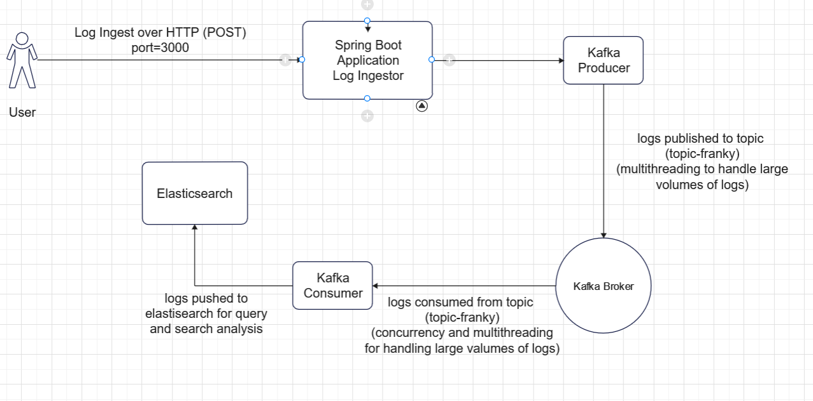
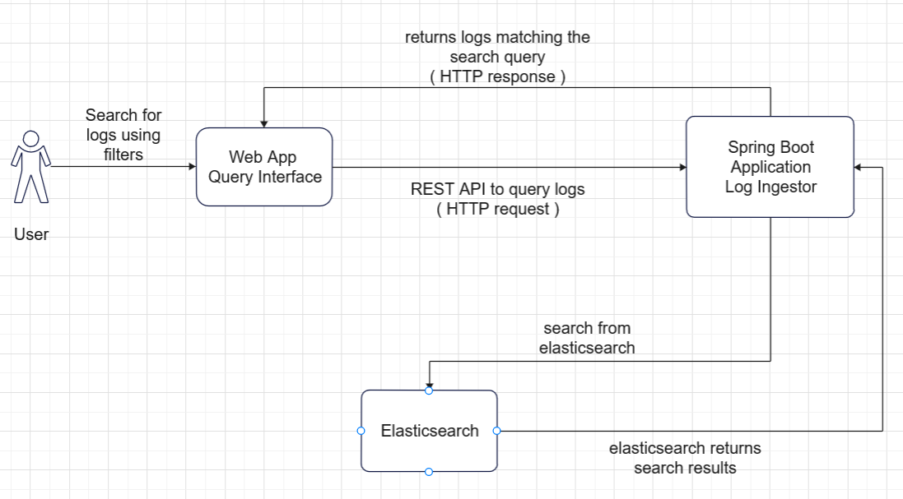
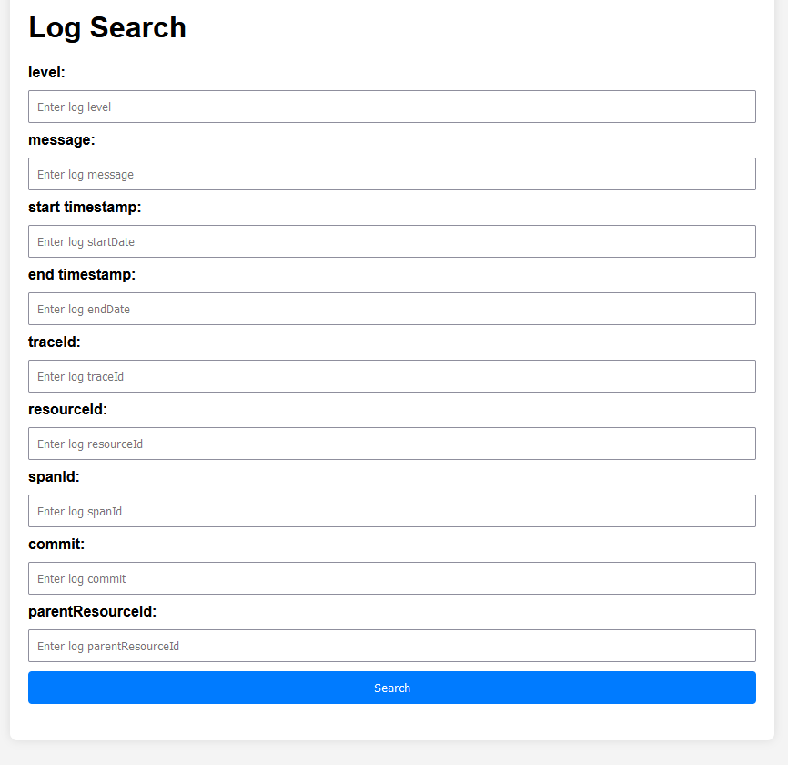

[![LinkedIn][linkedin-shield]][linkedin-url]

<a name="readme-top"></a>

<br />
<div align="center">
  <h3 align="center">FRANKY</h3>

  <p align="center">
    Log Ingestor Web Application
    <br />
    <a href="https://github.com/othneildrew/Best-README-Template">View Demo</a>
</div>

<!-- TABLE OF CONTENTS -->
<details>
  <summary>Table of Contents</summary>
  <ol>
    <li>
      <a href="#about-the-project">About The Project</a>
      <ul>
        <li><a href="#built-with">Built With</a></li>
      </ul>
    </li>
    <li><a href="#sys-des">System Design</a></li>
    <li>
      <a href="#getting-started">Getting Started</a>
      <ul>
        <li><a href="#prerequisites">Prerequisites</a></li>
        <li><a href="#installation">Installation</a></li>
      </ul>
    </li>
    <li><a href="#instructions">Instructions</a></li>
    <li><a href="#contact">Contact</a></li>>
  </ol>
</details>


<!-- ABOUT THE PROJECT -->
## About The Project

This idea of this project is to build a End-To-End Web Application for Log Ingestion that can efficiently handle vast volumes of log data, and offer a simple interface for querying this data using full-text search or specific field filters. The logs are ingested over HTTP on port `3000`. I have tried my best to ensure scalability to handle high volumes of logs efficiently using event-driven distributed architecture.

Sample Log Data Format:
  ```sh
{
	"level": "error",
	"message": "Failed to connect to DB",
    "resourceId": "server-1234",
	"timestamp": "2023-09-15T08:00:00Z",
	"traceId": "abc-xyz-123",
    "spanId": "span-456",
    "commit": "5e5342f",
    "metadata": {
        "parentResourceId": "server-0987"
    }
}
  ```
<p align="right">(<a href="#readme-top">back to top</a>)</p>

### Built With

This section should list any major frameworks/libraries used to bootstrap your project. Leave any add-ons/plugins for the acknowledgements section. Here are a few examples.

* [![Java]]
* [![Spring-Boot]]
* [![HTML-CSS]]
* [![JavaScript]]
* [![Apache Kafka]]
* [![Elasticsearch]]

<p align="right">(<a href="#readme-top">back to top</a>)</p>

<!-- SYSTEM DESIGN -->
## System Design

### Log Ingestion Design


### Query Design



<!-- GETTING STARTED -->
## Getting Started

Instructions on setting up the project locally.
To get a local copy up and running follow these simple example steps.

### Prerequisites

Setup of the following is needed locally to run the application :

* Java 1.8
* Spring Boot 2.7.17
* Apache Kafka 3.2.3
* Elasticsearch 8.11.1

### Installation

1. Clone the repository
   ```sh
   git clone https://github.com/your_username_/Project-Name.git
   ```
2. Run zookeeper
   ```sh
   zookeeper-server-start.bat ..\..\config\zookeeper.properties
   ```
3. Run kafka server
   ```sh
   kafka-server-start.bat ..\..\config\server.properties
   ```
4. Create kafka topic
   ```js
   kafka-topics.bat --create --topic topic-franky --bootstrap-server localhost:9092 --replication-factor 1 --partitions 3
   ```
5. Change the ssl config to false
6. Run elasticsearch
   ```sh
   bin\elasticsearch.bat
   ```
7. Run the Spring Boot application

## Instructions
1. The application would run on port `3000`
2. It provides two APIs for log ingestion
   ```sh
   This API can be used to insert one log JSON at a time:
   
   POST http://localhost:3000/api/logs/ingest
   ```
   ```sh
   Request Body :
   
   {
     "level": "info",
     "message": "Failed to connect to DB",
     "resourceId": "server-11",
     "timestamp": "2023-09-15T08:00:00Z",
     "traceId": "abc-xyz-17",
     "spanId": "span-16",
     "commit": "5e5342f",
     "metadata": {
        "parentResourceId": "server1-0395"
     }
   }
   ```
   ```sh
   This API can be used to insert multiple log JSON at a time:
   
   POST http://localhost:3000/api/logs/ingest/batch
   ```
   ```sh
   Request Body :
   [{
	    "level": "error",
	    "message": "Failed to connect to DB",
        "resourceId": "server-1234",
	    "timestamp": "2021-09-09T08:00:00Z",
	    "traceId": "abc-xyz-40",
        "spanId": "span-1",
        "commit": "5f5342f",
        "metadata": {
            "parentResourceId": "server1-0395"
        }
    },
    {
        "level": "debug",
        "message": "Failed to connect to DB",
        "resourceId": "server-1234",
        "timestamp": "2021-09-10T08:00:00Z",
        "traceId": "abc-xyz-41",
        "spanId": "span-2",
        "commit": "5f5342f",
        "metadata": {
            "parentResourceId": "server2-0495"
        }
    }]
   ```   
3. Once the logs are pushed, we can query using a simple query interface
   ```sh
   http://localhost:3000/index.html
   ```
   

4. Use a filter or multiple filters to search the logs.   

<p align="right">(<a href="#readme-top">back to top</a>)</p>

## Features
- Offer a user interface (Web UI or CLI) for full-text search across logs.
- Include filters based on:
    - level
    - message
    - resourceId
    - timestamp
    - traceId
    - spanId
    - commit
    - metadata.parentResourceId
- Bonus feature
    - Implement search within specific date ranges
    - Allow combining multiple filters
    - Provide real-time log ingestion and searching capabilities.


## Contact

Kallol Bairagi - [@kallob14](https://twitter.com/kallolb14) - kallolb22@gmail.com

Project Link: [https://github.com/dyte-submissions/november-2023-hiring-kbnewbee](https://github.com/dyte-submissions/november-2023-hiring-kbnewbee)


<p align="right">(<a href="#readme-top">back to top</a>)</p>


[Java]: https://img.shields.io/badge/Java-blue
[Spring-Boot]: https://img.shields.io/badge/Spring%20Boot-green
[HTML-CSS]: https://img.shields.io/badge/HTML%2FCSS-orange
[JavaScript]: https://img.shields.io/badge/JavaScript-yellow
[Apache Kafka]: https://img.shields.io/badge/Apache%20Kafka-white
[Elasticsearch]: https://img.shields.io/badge/Elasticsearch-violet

[linkedin-shield]: https://img.shields.io/badge/-LinkedIn-black.svg?style=for-the-badge&logo=linkedin&colorB=555
[linkedin-url]: https://www.linkedin.com/in/kallolbairagi
